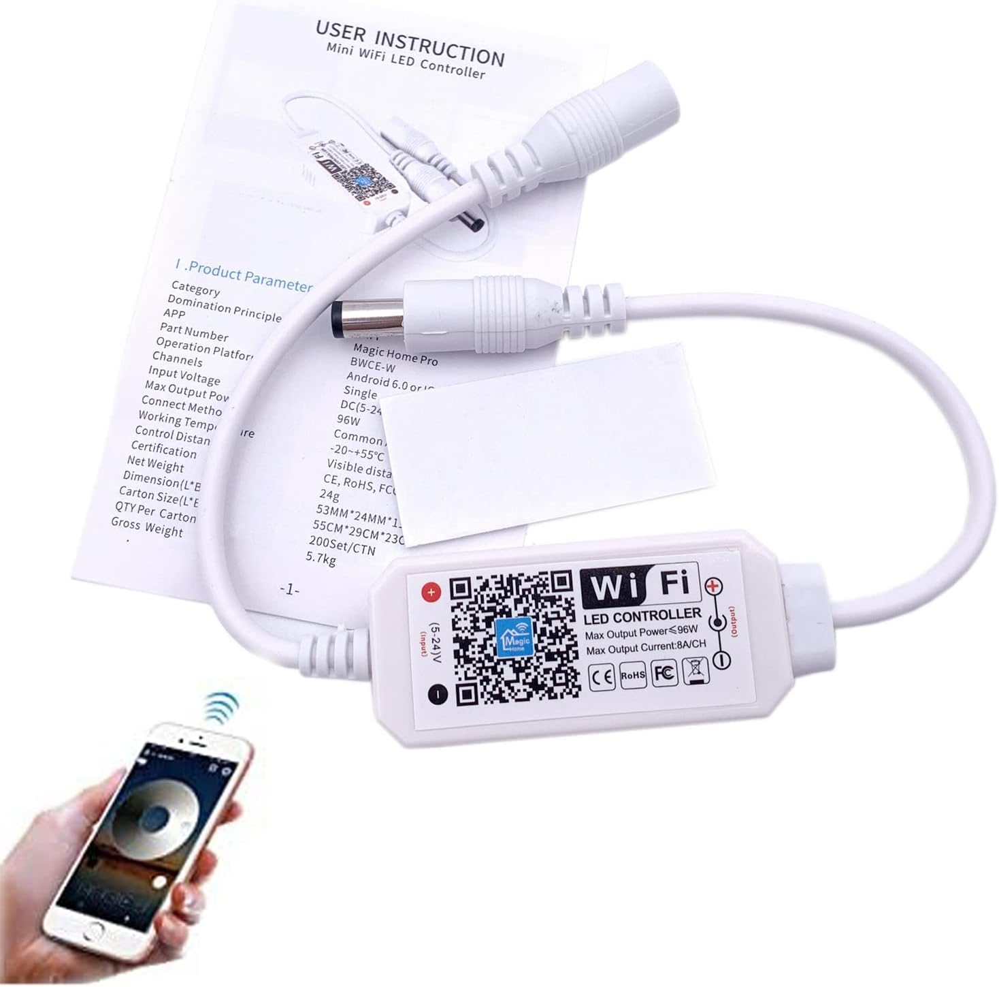

# Homebridge MagicHome LED Controller

A Homebridge plugin for controlling MagicHome single color LED strips through HomeKit.

<div align="center">
  
</div>

## Features

- **HomeKit Integration**: Control your MagicHome single color LED strips through the Apple Home app
- **Brightness Control**: Adjust brightness levels (mapped to red channel intensity for single color strips)
- **Real-time Status Updates**: Automatic polling of device state with configurable intervals (1-300 seconds)
- **Flexible Device Configuration**: Support for both IP addresses and MAC addresses
- **Automatic MAC Resolution**: Converts MAC addresses to IP addresses using ARP table lookup
- **Multiple Device Support**: Configure and control multiple MagicHome devices
- **Custom Configuration UI**: User-friendly setup interface through Homebridge UI
- **Comprehensive Logging**: Detailed device operation logs with human-readable device names

## Installation

1. Install the plugin through Homebridge UI or via npm:
```bash
npm install -g homebridge-magichome-led-controller
```

2. Configure the plugin in your Homebridge `config.json` or through the Homebridge UI

## Configuration

### Option 1: Homebridge UI (Recommended)

The plugin includes a custom configuration interface that makes setup easy:

1. Open the Homebridge UI
2. Go to the "Plugins" tab
3. Find "Homebridge MagicHome LED Controller" and click "Settings"
4. Use the intuitive interface to add your devices

### Option 2: Manual Configuration

Add the platform to your `config.json`:

```json
{
  "platforms": [
    {
      "platform": "HomebridgeMagichomeLedController",
      "pollingInterval": 5,
      "lights": [
        {
          "name": "Kitchen LEDs",
          "address": "192.168.1.90"
        },
        {
          "name": "Living Room LEDs", 
          "address": "F4CFA20FC87B"
        }
      ]
    }
  ]
}
```

### Configuration Options

| Option | Type | Required | Default | Description |
|--------|------|----------|---------|-------------|
| `platform` | string | Yes | - | Must be "HomebridgeMagichomeLedController" |
| `pollingInterval` | number | No | 5 | Status polling interval in seconds (1-300 seconds) |
| `lights` | array | Yes | - | Array of light device configurations (minimum 1 device) |

### Light Device Configuration

| Option | Type | Required | Validation | Description |
|--------|------|----------|------------|-------------|
| `name` | string | Yes | 1-50 characters | Display name for the device in HomeKit |
| `address` | string | Yes | IP or MAC format | IP address or MAC address of the device |

### Address Formats

The plugin supports multiple address formats:

- **IP Address**: `192.168.1.90`
- **MAC Address (with colons)**: `AA:BB:CC:DD:EE:FF`
- **MAC Address (with hyphens)**: `AA-BB-CC-DD-EE-FF`
- **MAC Address (no separators)**: `AABBCCDDEEFF`

When using MAC addresses, the plugin will automatically resolve them to IP addresses using the system's ARP table.

## Device Compatibility

This plugin is specifically designed for MagicHome single color LED strips that support the `magic-home` npm package protocol. 

**Supported devices:**
- MagicHome single color LED strips
- MagicHome WiFi LED controllers for single color strips

**Note:** While this plugin can technically control RGB LED strips, it is optimized for single color strips and will only use the red channel for brightness control.

## How It Works

1. **Device Discovery**: The plugin reads configured devices from the config file
2. **Address Resolution**: MAC addresses are resolved to IP addresses via ARP lookup
3. **Device Control**: Uses the `magic-home` npm package to communicate with devices
4. **State Synchronization**: Polls device status at configurable intervals
5. **HomeKit Integration**: Exposes devices as HomeKit lightbulb accessories

## Brightness Mapping

The plugin maps HomeKit brightness (0-100%) to the red channel of the LED device (0-255). This design is specifically optimized for single color LED strips, providing precise brightness control through the red channel intensity.

## Troubleshooting

### Device Not Found
- Ensure the device is powered on and connected to the same network
- For MAC addresses, verify the device is in the ARP table: `arp -a`
- Check that the IP address is correct and reachable

### Connection Issues
- Verify firewall settings allow communication on the device's port
- Ensure the MagicHome device firmware is compatible
- Check network connectivity between Homebridge and the device

### Configuration Issues
- Verify the `platform` name is exactly "HomebridgeMagichomeLedController"
- Ensure at least one device is configured in the `lights` array
- Check device names are between 1-50 characters
- Validate address formats match the supported patterns

### Logs
Monitor the Homebridge logs for detailed error messages and status updates. The plugin provides comprehensive logging for device operations and state changes using human-readable device names.

## Development

### Setup Development Environment

1. Clone the repository
2. Install dependencies:
```bash
npm install
```

3. Build the plugin:
```bash
npm run build
```

4. Link for development:
```bash
sudo hb-service link
sudo hb-service restart
```

## Contributing

Contributions are welcome! Please feel free to submit issues and pull requests.

## Requirements

- **Node.js**: 18.20.4+ or 20.18.0+ or 22.10.0+
- **Homebridge**: 1.8.0+ or 2.0.0-beta.0+
- **Network**: MagicHome devices must be on the same network as Homebridge

## License

This project is licensed under the Apache License 2.0 - see the [LICENSE](LICENSE) file for details.

## Credits

- Built on the [Homebridge Plugin Template](https://github.com/homebridge/homebridge-plugin-template)
- Uses the [magic-home](https://www.npmjs.com/package/magic-home) npm package for device communication
